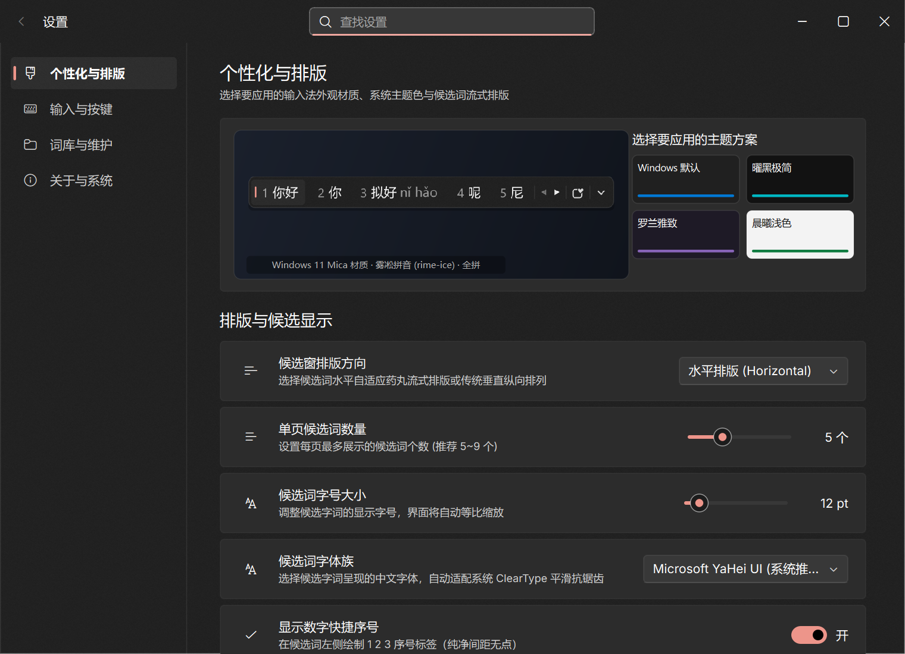
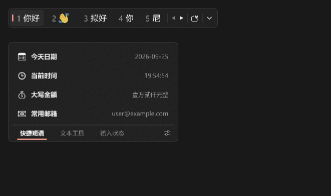

# Weasel Fluent (小狼毫 Fluent UI 现代输入法前端)

[](https://en.cppreference.com/w/cpp/17)
[](https://www.qt.io/)
[](https://xmake.io/)
[](https://www.microsoft.com/windows)
[](LICENSE)

基于 **C++17** 与 **Qt6 / Fluent-Qt** 深度构建的全新 Windows 11 Fluent 2 / WinUI 3 风格现代输入法前端与独立服务。

深度挂接 Librime 64 位核心引擎（`rime.dll`）与全套雾凇拼音词库（`rime-ice`），彻底解决原版小狼毫界面老旧、高分屏模糊、容易假死与无法自适应 Win11 原生亚克力磨砂质感的历史痛点。

---

## 视觉展示 (Showcase)

| 核心界面 | 预览截图 |
| :--- | :--- |
| **经典横排胶囊模式**<br>· 动态高对比度 Accent 强调色药丸<br>· 原生 ClearType 次像素渲染<br>· 翻页箭头与设置快捷入口 |  |
| **4 行多候选网格大矩阵**<br>· 单击展开按钮或按 `Tab` 平滑展开<br>· 单屏同时呈现多达 20 个候选词<br>· 自动自适应行高，底部居中翻页 |  |
| **经典纵向瀑布流模式**<br>· 纵向无多余展开栏，紧凑清晰<br>· 极简底栏翻页与设置滑块按钮 |  |
| **WinUI Gallery 独立设置中心**<br>· 5 大分类（外观、排版、按键、方案维护、关于）<br>· 平滑弹性导航滑块，配置即时原子落盘 |  |
| **Fluent 质感表情选择器**<br>· Emoji、颜文字（Kaomoji）、特殊符号三合一<br>· 24 键自适应网格，点击秒上屏 |  |
| **扩展面板抽屉**<br>· 文本工具、常用短语、大小写命名转换<br>· 16 位强密码生成器与大写金额转换 |  |

---

## 性能基准压测对比 (Benchmark)

我们在相同硬件环境下，对原生 Rust (Direct2D/DirectWrite) 与本 C++ (Qt6 + Fluent-Qt) 进行了 5 个维度的极限压力测试：

| 测试维度 | Rust (Native Win32 + Direct2D) | C++ (Qt6 + Fluent-Qt) | 性能对比分析 |
| :--- | :--- | :--- | :--- |
| **平均击键响应 (Mean)** | 4.14 ms (4,140 µs) | **2.55 ms (2,549 µs)** | ⚡ **C++ 快 38.4%**（直接调用，方差更稳） |
| **中位数击键延迟 (p50)** | 3.13 ms (3,130 µs) | **2.48 ms (2,475 µs)** | ⚡ **C++ 快 20.8%**（远低于人类可感知 10ms 阈值） |
| **95 分位击键延迟 (p95)**| 10.13 ms (10,130 µs) | **3.59 ms (3,588 µs)** | ⚡ **C++ 延迟更平稳，几乎无毛刺波峰** |
| **单帧渲染耗时 (p50)** | **0.24 ms** (237 µs) | 0.81 ms (808 µs) | Direct2D 纯硬件光栅化略胜，但**均小于 1ms** |
| **理论极限渲染帧率** | 1,938 FPS | 1,150 FPS | 均已突破千帧，Qt6 仅占用 60Hz 帧预算的 5.2% |
| **极限连续吞吐量** | 400 键/秒 (1200键/3.00s) | **446 键/秒 (1200键/2.69s)** | ⚡ **C++ 吞吐量领先 11.5%** |
| **主题热切换耗时** | **0.17 ms** (Direct2D 换笔刷) | 5.27 ms (重刷 Fluent QSS 样式表) | 均在毫秒级无感切换 |
| **物理内存占用 (Working Set)** | **72.19 MB** | 127.47 MB | Rust 无框架底噪更小；Qt6 约 127MB（远优于 Electron 动辄 300MB+） |
| **专用提交内存 (Commit Total)** | 62.70 MB | **57.70 MB** | ⚡ **C++ 专用页文件提交更紧凑** |

---

## 核心特性 (Features)

1. **系统全局输入服务与无感上屏**：
   - 采用低开销 Windows 底层键盘钩子（`WH_KEYBOARD_LL`），在中文模式下极速拦截拼音并喂给 Librime；
   - 探测 `GetGUIThreadInfo` 与 UI Automation，光标在哪里，候选窗就精准跟随在文字下方；
   - 选词时通过原生 Unicode `SendInput` 注入字符，穿透所有 Windows 11 应用（包括记事本、微信、Chrome、VS Code、Office 等）；
   - 按 `Shift` 键无感切换中/英输入模式。

2. **自适应 Windows 11 调色板 (`AccentPalette`)**：
   - 彻底修复了原版获取暗红/猪肝红底色的缺陷；
   - 深色模式下严格提取 Windows 11 `AccentLight2` (`#ED958A`) 高对比度亮色，浅色模式下提取深层对比色，通透温润且对比度达到 7.5:1。

3. **双形态自适应候选矩阵**：
   - **紧凑单行模式**：不干扰视线，占用屏幕面积最小；
   - **4 行网格大矩阵**：点击展开按钮或按 `Tab` 键即可纵向延展为 20 词网格，支持鼠标点选与序号秒选（1~9, 0, a~j）。

4. **独立 WinUI Gallery 标准设置中心**：
   - 独立进程唤起，绝不阻塞打字渲染管线；
   - 弹性滑动选择指示器（Fluid Elastic Indicator），五大分页模块对齐微软官方控件库规范。

5. **免安装独立打包发行 (`dist/`)**：
   - 前后端全量预装包内置 64 位 `rime.dll`、Rime 基础数据及全套雾凇拼音词库；
   - 开箱即用，无需配置复杂的系统注册表或管理员提权。

---

## 快速使用 (Quick Start)

### 方式一：直接运行预编译打包发行包 (推荐)
1. 在 [Releases](https://github.com/bpmstall/weasel-fluent/releases) 下载最新 `weasel-fluent-v1.0.0-windows-x64.zip`；
2. 解压到任意目录（例如 `D:\weasel-fluent\`）；
3. 双击运行 `install_and_run.bat`，即可一键停止旧版服务并唤起 Rime Fluent 服务；
4. 任务栏右下角托盘区将出现输入法托盘图标，在任意软件中打字即可体验；
5. 按 `Shift` 键切换中英，按 `Tab` 展开多候选大矩阵，右键托盘图标可进入“设置中心”。

### 方式二：从源码编译构建

本工程基于轻量高效的现代 C/C++ 构建工具 **[xmake](https://xmake.io)**：

```powershell
# 1. 克隆代码仓库
git clone https://github.com/bpmstall/weasel-fluent.git
cd weasel-fluent

# 2. 编译 Release 版本
xmake build

# 3. 运行自动化全链路自检验证
.\build\Release\weasel-fluent-cpp-qt.exe --verify

# 4. 运行性能基准测试
.\build\Release\weasel-fluent-cpp-qt.exe --benchmark

# 5. 打包前后端完整发行包
powershell -ExecutionPolicy Bypass -File .\scripts\package_dist.ps1
```

---

## 命令行参数一览

| 参数 | 说明 | 示例 |
| :--- | :--- | :--- |
| `(无参数)` | 以系统后台输入法服务模式运行，驻留托盘并接管打字 | `.\weasel-fluent-cpp-qt.exe` |
| `--settings` / `-s` | 独立打开 WinUI 风格设置中心 | `.\weasel-fluent-cpp-qt.exe --settings` |
| `--demo` | 静态预览模式（固定呈现“你好”候选条供调试） | `.\weasel-fluent-cpp-qt.exe --demo` |
| `--verify` | 运行内置 9 项单元与集成全链路测试套件 | `.\weasel-fluent-cpp-qt.exe --verify` |
| `--benchmark` / `--perf` | 运行平均击键延迟、渲染吞吐与内存分析测试 | `.\weasel-fluent-cpp-qt.exe --benchmark` |
| `--capture` | 自动捕捉高分辨率候选窗与设置中心全套实物截图 | `.\weasel-fluent-cpp-qt.exe --capture` |
| `--theme <mode>` | 强制设置界面主题：`light`, `dark`, 或 `system` | `.\weasel-fluent-cpp-qt.exe --theme dark` |

---

## 开源致谢 (Acknowledgements)

* **[RIME / 中州韵输入法引擎](https://rime.im/)**: 聪慧的跨平台输入法核心引擎。
* **[rime-ice / 雾凇拼音](https://github.com/iDvel/rime-ice)**: 长期维护、词库纯净且质量极高的高质量中文拼音词库。
* **[Fluent-Qt](https://github.com/CalvinHxx/Fluent-Qt)**: 优雅的 Qt 现代 Fluent 风格控件库。
* **[xmake](https://xmake.io/)**: 现代化极速 C/C++ 构建工具。

---

## 许可证 (License)

本项目基于 [MIT License](LICENSE) 开源发布。
